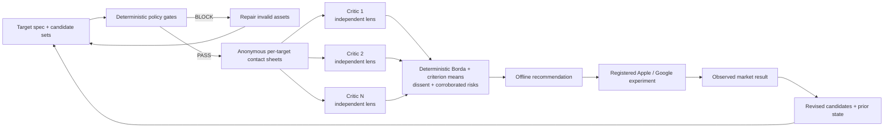
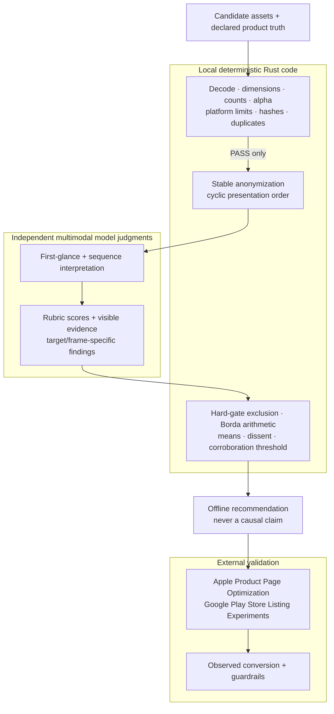
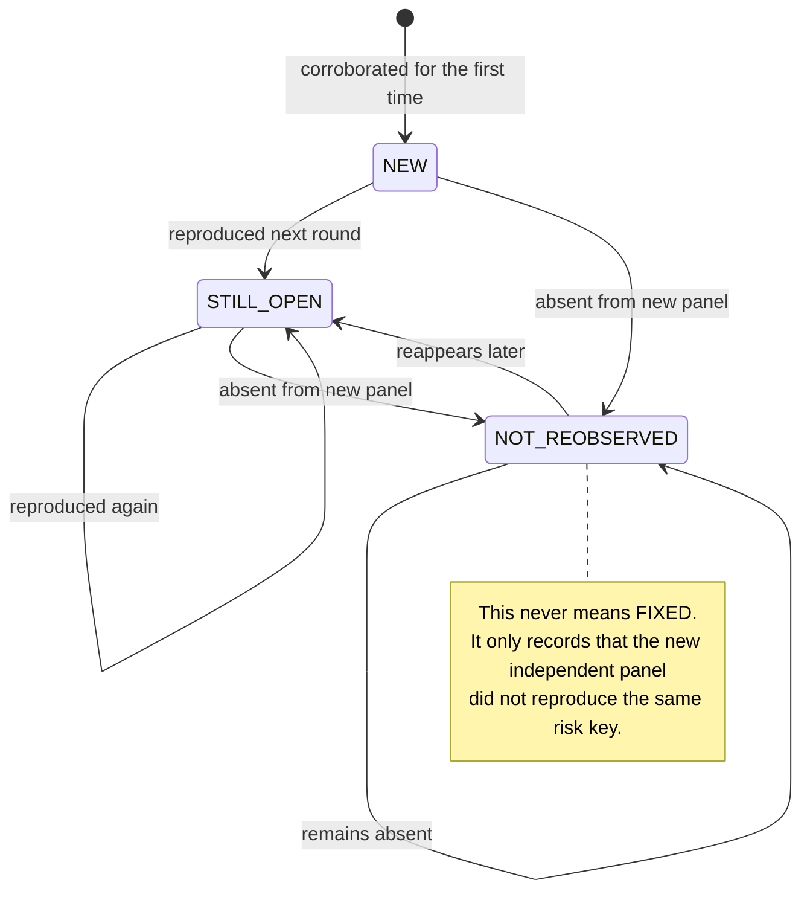

# store-creative-loop

`storeloop` reviews complete app-store creative sets—screenshots, phone/tablet variants, locales, and Google Play feature graphics—without treating an AI panel as conversion truth.

## The loop



## Who is allowed to decide what?



## Refinement state semantics



## Why a separate loop?

[`aso-loop`](https://github.com/Loop-Suite/aso-loop) handles listing text and [`icon-loop`](https://github.com/Loop-Suite/icon-loop) handles icons. Store screenshots are a different system: meaning depends on the ordered set, thumbnail scale, copy over product UI, locale, device class, and platform constraints. This repository accepts output from any design tool or generator and concentrates on review, evidence, and iteration.

## What is deterministic?

- Decoding, pixel size, actual alpha transparency, required asset count, platform maximum, Google screenshot geometry, feature-graphic dimensions, hashes, and byte-identical duplicates.
- Candidate anonymization, cyclic presentation-order shifts, hard-gate exclusion, Borda arithmetic, criterion means, and the “reported by at least two critics” corroboration threshold.

Visual scores are model judgments. A deterministic calculation over those judgments is reproducible arithmetic—not verified user preference, causal impact, or truth. `report.md` therefore says **offline recommendation**, and `experiment.md` is the required market-validation handoff.

## Input convention

Each immediate child of the candidates directory is one complete candidate. Each target id from the TOML spec is a subdirectory; lexical filename order is the intended frame order.

```text
candidates/
  concept-a/
    apple_iphone_65_ko/01.png
    apple_iphone_65_ko/02.png
    apple_ipad_13_ko/01.png
    google_phone_ko/01.png
    google_feature_ko/01.png
  concept-b/
    ...
```

Start from [`specs/example.toml`](specs/example.toml). Platform requirements change, so confirm the target sizes against the current official documentation before production submission.

## Install and run

Requirements: a Rust toolchain and either the Claude CLI or `OPENROUTER_API_KEY`. Multiple provider families are recommended because several judges from one family can be highly correlated.

```bash
cargo build --release

# Fast, deterministic checks; non-zero exit when any candidate is blocked.
target/release/storeloop validate \
  --spec specs/example.toml \
  --candidates ./candidates \
  --json ./validation.json

# Full blind review. The default panel has three independent calls.
target/release/storeloop review \
  --spec specs/example.toml \
  --candidates ./candidates \
  --out ./runs/round-01 \
  --critics 3

# Re-review a revision. NOT_REOBSERVED intentionally does not mean fixed.
target/release/storeloop refine \
  --spec specs/example.toml \
  --candidates ./revised-candidates \
  --prior ./runs/round-01/state.json \
  --out ./runs/round-02
```

Outputs:

- `state.json`: machine-readable policy evidence, blind map, independent reviews, arithmetic, and prior-round statuses.
- `report.md`: audit-friendly offline recommendation, dissent, provider-correlation warning, and corroborated risks.
- `experiment.md`: pre-registration template for Apple Product Page Optimization or Google Play Store Listing Experiments.
- `blind/`: locally generated contact sheets shown to critics.

## Review safeguards

- Critics do not see each other’s output; this avoids sequential anchoring and conformity.
- Candidate order rotates by critic to reduce position bias.
- A policy-blocked candidate cannot win, regardless of model preference.
- Unanimity creates a correlation warning. Provider diversity is recorded, not assumed.
- A risk needs two independent critics before it is promoted as corroborated.
- Refinement records `STILL_OPEN`, `NEW`, or `NOT_REOBSERVED`; it never silently upgrades absence to “fixed.”
- The recommended creative must still be tested against the live control with one declared variable and explicit guardrails.

## Research basis

The architecture is based on a scoped survey of Loop-Suite patterns, store-creative tooling, snapshot/diff infrastructure, academic work on rapid visual judgment and LLM-judge bias, design-team critique practices, and controlled experimentation. See [`docs/research-and-evidence-survey-2026-08-02.md`](docs/research-and-evidence-survey-2026-08-02.md) for sources, transfer decisions, and limitations.

## License

Apache-2.0. See [`NOTICE`](NOTICE) for derived-code attribution.
