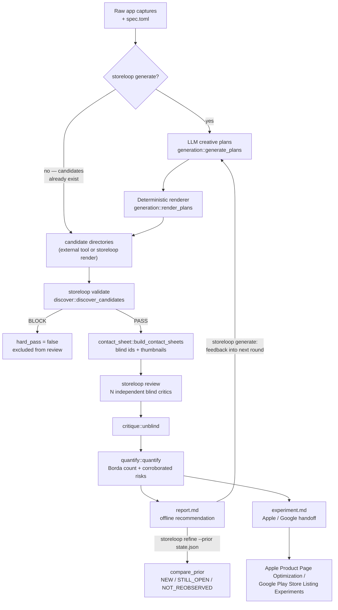
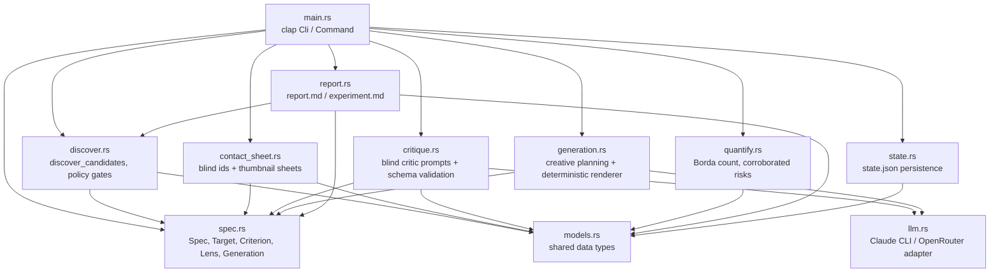
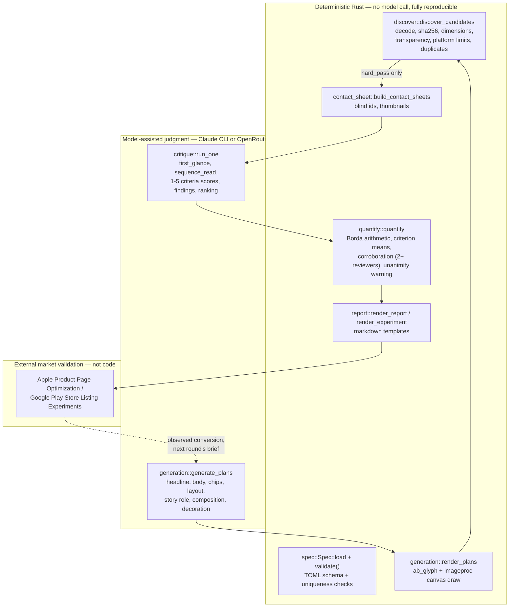
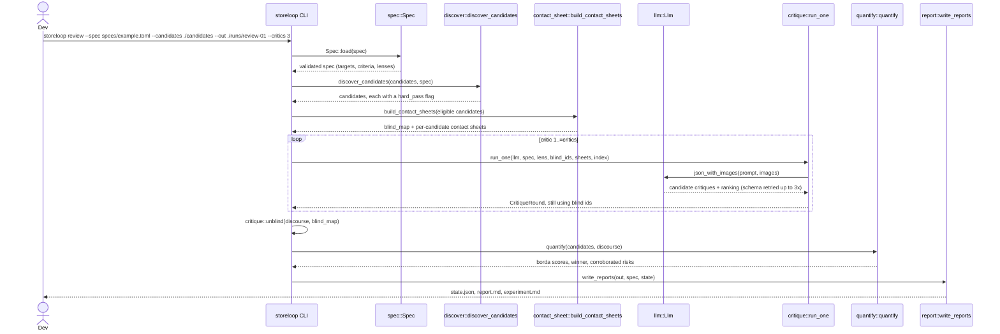
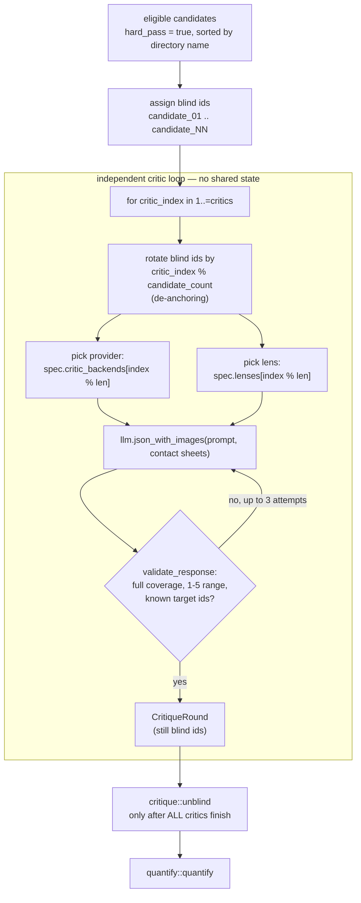
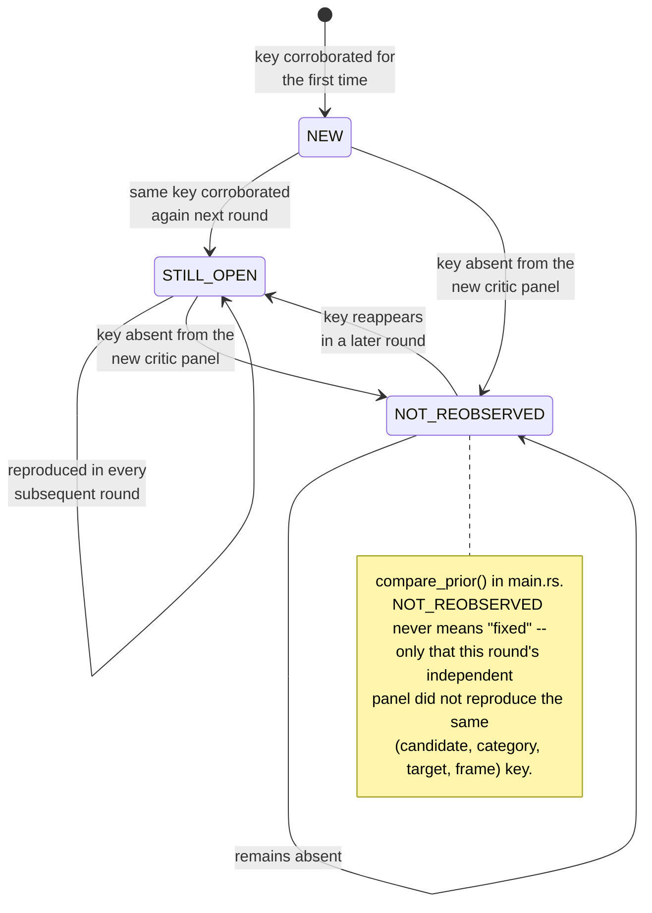

# store-creative-loop

**App-store creative review loop — validate → blind multi-lens critique → deterministic verdict → experiment handoff.**

`storeloop` is a Rust CLI (binary name `storeloop`) that turns app-store creative sets — phone/tablet screenshots and Google Play feature graphics — into a reviewed, evidence-based recommendation. It can also *generate* those creative sets from raw product captures, render them deterministically, and feed independent-critic feedback into the next round. Review is an internal gate in the loop, never a substitute for a live store experiment: the pipeline's own reports say so explicitly.

This document is grounded entirely in the current `src/`, `specs/example.toml`, `Cargo.toml`, and `NOTICE` of this repository — no invented commands, flags, or architecture.

## Table of contents

- [What it does](#what-it-does)
- [Pipeline overview](#pipeline-overview)
- [Why a dedicated screenshot loop?](#why-a-dedicated-screenshot-loop)
- [Architecture](#architecture)
- [Deterministic code vs. model judgment](#deterministic-code-vs-model-judgment)
- [CLI reference](#cli-reference)
- [Stage 1 — Validate: deterministic policy gates](#stage-1--validate-deterministic-policy-gates)
- [Stage 2 — Review: blind multi-lens critique](#stage-2--review-blind-multi-lens-critique)
- [Stage 3 — Verdict: deterministic aggregation](#stage-3--verdict-deterministic-aggregation)
- [Stage 4 — Experiment handoff](#stage-4--experiment-handoff)
- [Iterating: refine and the corroborated-risk lifecycle](#iterating-refine-and-the-corroborated-risk-lifecycle)
- [Generation loop: creative families and art direction](#generation-loop-creative-families-and-art-direction)
- [Spec file (`specs/example.toml`)](#spec-file-specsexampletoml)
- [Raw capture convention](#raw-capture-convention)
- [Outputs](#outputs)
- [Requirements & setup](#requirements--setup)
- [Research basis](#research-basis)
- [License](#license)

## What it does

Given a TOML spec (targets, review criteria, critic lenses, and an optional `[generation]` section) and either a folder of candidate screenshot sets or raw app captures, `storeloop`:

1. **Validates** every candidate's screenshots/feature graphics against deterministic file and platform-policy gates (decoding, exact pixel dimensions, transparency, asset counts, duplicate/near-duplicate detection).
2. **Anonymizes** the candidates that pass into blind, thumbnail-scale contact sheets and reviews them with several independent, non-communicating LLM-backed critics, each assigned a distinct review lens and a rotated candidate order to reduce anchoring and position bias.
3. **Aggregates** the critics' rankings and 1–5 rubric scores with local, deterministic arithmetic — Borda count, per-criterion means, and a corroboration threshold that only promotes a risk finding once at least two independent critics reported it.
4. **Hands off** the offline winner to a pre-registered Apple Product Page Optimization / Google Play Store Listing Experiment template, and (optionally) feeds the round's criterion means, corroborated risks, and minority opinions back into the next generation round.

## Pipeline overview



## Why a dedicated screenshot loop?

[`aso-loop`](https://github.com/Loop-Suite/aso-loop) handles listing text and [`icon-loop`](https://github.com/Loop-Suite/icon-loop) handles icons. Store screenshots need an ordered story across device classes: marketing copy sits over real product UI, the first frames must work at thumbnail scale, tablet composition cannot be a blind phone enlargement, and every store target has exact export constraints. The vision-LLM adapter in `src/llm.rs` is ported from `icon-loop` under Apache-2.0 (see [`NOTICE`](NOTICE)).

The creative plan (`generation.json`) is editable JSON and the renderer is deterministic pure-Rust drawing (`ab_glyph` + `imageproc`). The same plan and source captures therefore reproduce the same target PNGs without another model call — that reproduction path is exactly what `storeloop render` exposes.

## Architecture



| File | Role |
|---|---|
| `src/main.rs` | `clap` CLI (`Cli`/`Command`), orchestrates every subcommand, computes prior-round risk comparison |
| `src/spec.rs` | Parses and validates `specs/*.toml` into `Spec` (targets, criteria, lenses, `[generation]`, `[experiment]`) |
| `src/discover.rs` | Decodes candidate images and applies deterministic policy gates; produces `hard_pass` |
| `src/contact_sheet.rs` | Renders blind thumbnail contact sheets and assigns anonymous `candidate_NN` ids |
| `src/llm.rs` | Vision-call adapter for the Claude CLI and OpenRouter (ported from `icon-loop`) |
| `src/critique.rs` | Builds each critic's blind, rotated-order prompt and validates the returned JSON schema |
| `src/generation.rs` | LLM creative planning (`generate_plans`) and the deterministic PNG renderer (`render_plans`) |
| `src/quantify.rs` | Borda-count aggregation, per-criterion means, corroborated-risk grouping |
| `src/report.rs` | Renders `report.md` (offline recommendation) and `experiment.md` (handoff template) |
| `src/state.rs` | Reads/writes `state.json`, the full round record consumed by `refine` |
| `src/models.rs` | Shared serde types: `Candidate`, `CritiqueRound`, `QuantResult`, `State`, etc. |

## Deterministic code vs. model judgment



Safeguards this boundary enforces:

- Pixel decoding, exact dimensions, alpha/transparency, per-target asset counts, SHA-256 duplicate detection, blind-id assignment, Borda arithmetic, and corroboration thresholds are deterministic Rust — never model output.
- `spec.prohibited_claims` (exact substrings) and a fixed trust-marker list (`#1`, `최고`, `award`, ratings/stars, `%`, `guarantee`, download-count language, …) are checked against every LLM-generated plan in `generation::validate_copy_claims` **before rendering**; a trust marker is only allowed if the exact token is present in `generation.verified_claim_tokens`.
- A candidate with any `BLOCK`-severity policy issue cannot become the Borda winner, regardless of critic preference.
- Critics never see each other's ranking, scores, or identity; a risk needs two independent critics before it is reported as `corroborated`.
- `NOT_REOBSERVED` (see below) never silently means "fixed."
- Every `report.md` and `experiment.md` states the verdict boundary: an offline, model-assisted recommendation, not market validation.

## CLI reference

All flags are exact `clap` definitions from `src/main.rs`. Global flags apply to every subcommand: `--claude-bin` (default `claude`), `--claude-model`, `--retries` (default `1`), `--verbose`.

| Command | Purpose (from `main.rs` doc comments) | Flags |
|---|---|---|
| `validate` | Run deterministic file and platform-policy gates only | `--spec`, `--candidates`, `--json` (optional) |
| `review` | Validate, blind, independently critique, aggregate, and create an experiment handoff | `--spec`, `--candidates`, `--out`, `--critics` (default `3`) |
| `refine` | Run a new round while tracking whether prior corroborated risks are re-observed | `--spec`, `--candidates`, `--prior`, `--out`, `--critics` (default `3`) |
| `generate` | Generate real store PNGs, review variants, and feed the winner into the next round | `--spec`, `--raw`, `--font`, `--out`, `--variants` (default `3`), `--iterations` (default `2`), `--critics` (default `3`), `--segment` (default `default`) |
| `render` | Deterministically re-render an editable `generation.json` without another LLM call | `--spec`, `--raw`, `--font`, `--manifest`, `--out` |

```bash
cargo build --release

# Full loop: LLM creative plans -> deterministic render -> blind review -> next round
target/release/storeloop generate \
  --spec specs/example.toml \
  --raw ./raw \
  --font /path/to/KoreanFont.ttc \
  --out ./runs/store-set-01 \
  --segment new_user \
  --variants 3 \
  --iterations 2 \
  --critics 3

# Edit generation.json by hand, then reproduce PNGs deterministically (no LLM call)
target/release/storeloop render \
  --spec specs/example.toml \
  --raw ./raw \
  --font /path/to/KoreanFont.ttc \
  --manifest ./runs/store-set-01/round-01/generation.json \
  --out ./rerendered-candidates

# Externally designed candidates can enter directly at validate/review
target/release/storeloop validate \
  --spec specs/example.toml \
  --candidates ./candidates \
  --json ./validation.json

target/release/storeloop review \
  --spec specs/example.toml \
  --candidates ./candidates \
  --out ./runs/review-01 \
  --critics 3

# A later round, checking whether the prior round's corroborated risks recur
target/release/storeloop refine \
  --spec specs/example.toml \
  --candidates ./candidates-round-2 \
  --prior ./runs/review-01/state.json \
  --out ./runs/review-02 \
  --critics 3
```

`validate` exits non-zero if any candidate has a `BLOCK`-severity issue, so it doubles as a CI gate. `review`, `refine`, `generate`, and `render` all refuse to write into a non-empty `--out` directory (`ensure_fresh_output`), and `validate --json` refuses to overwrite an existing file.



## Stage 1 — Validate: deterministic policy gates

`discover::discover_candidates` decodes every image under `<candidates>/<candidate-id>/<target-id>/` and raises typed `PolicyIssue`s. A candidate's `hard_pass` is `true` only when it has zero `BLOCK`-severity issues.

| Code | Severity | Trigger |
|---|---|---|
| `invalid_image` | BLOCK | file fails to decode |
| `transparency` | BLOCK | any non-opaque pixel |
| `wrong_dimensions` | BLOCK | size not in the target's `allowed_sizes` (when declared) |
| `google_screenshot_geometry` | BLOCK | Google screenshot outside 320–3840 px or exceeds a 2:1 aspect ratio — enforced whenever a target declares no explicit `allowed_sizes` |
| `google_feature_graphic_dimensions` | BLOCK | Google feature graphic is not exactly 1024×500 — always enforced, regardless of spec |
| `missing_target` | BLOCK | a required target has zero assets |
| `wrong_asset_count` | BLOCK | count ≠ `exact_assets` |
| `too_few_assets` / `too_many_assets` | BLOCK | outside `min_assets`/`max_assets` |
| `platform_asset_limit` | BLOCK | more than Apple's 10 or Google's 8 screenshots — hardcoded, independent of spec |
| `non_zero_padded_sequence` | WARN | filenames not zero-padded once a target has 10+ files (lexical order risk) |
| `duplicate_assets` | WARN | byte-identical frames (SHA-256) inside one target |

`storeloop validate` prints `PASS`/`BLOCKED` per candidate, can dump the full result as JSON, and exits with an error if anything is blocked.

## Stage 2 — Review: blind multi-lens critique



Each critic is built from `spec.lenses` and `spec.critic_backends` (cycled by index) and asked to score every candidate against `spec.criteria` on a 1–5 scale, plus report `findings` (category, target, frame, severity, evidence, suggested fix), a one-line `first_glance`/`sequence_read`/`strongest_point`/`biggest_risk`, and a complete, tie-free `ranking`. `critique::run_one` retries the request up to 3 times with an explicit correction prompt if the JSON fails schema or coverage validation (missing candidates, out-of-range scores, unknown target ids, incomplete rankings).

`specs/example.toml` ships 6 lenses (`first_time_user`, `conversion_strategy`, `visual_design`, `trust_policy`, `accessibility_localization`, `device_specialist`) and 7 weighted criteria (`first_glance`, `value_clarity`, `sequence`, `visual_hierarchy`, `truth_trust`, `device_fit`, `localization_accessibility`). Criterion `weight` is shown to critics as emphasis guidance inside the prompt; the deterministic aggregation in `quantify.rs` does not itself apply numeric weighting — it works directly from rank order (Borda) and unweighted 1–5 score means.

## Stage 3 — Verdict: deterministic aggregation

`quantify::quantify` runs entirely in Rust on the unblinded critic output:

- **Borda count** — for each critic's ranking (filtered to `hard_pass` candidates), the first-ranked candidate gets `N` points, the next `N-1`, and so on; points are summed across all critics. The winner is the highest total, with ties broken deterministically by candidate id.
- **Criterion means** — the unweighted mean of every score a candidate received for each criterion.
- **Provider-diversity note** — counts distinct critic providers actually used; a single-provider panel is flagged explicitly ("agreement may reflect correlated model behavior").
- **Unanimous-first-choice warning** — set when every critic's top-ranked candidate is the same, framed as a correlation warning, not proof.
- **Minority opinions** — one line per critic whose first choice differs from the overall winner.
- **Corroborated risks** — `findings` are grouped by `(candidate, category, target, frame)`; a group is only promoted to `corroborated_risks` once at least two distinct critics reported it, with the evidence and the maximum reported severity attached.

A `BLOCK`-severity candidate from Stage 1 is excluded from `eligible` before any of this runs, so it can never win regardless of critic preference.

## Stage 4 — Experiment handoff

`report::render_experiment` writes `experiment.md`, a pre-registration template — explicitly *not* evidence of uplift by itself:

- **Hypothesis / Control / Treatment** — the Borda winner (or "no eligible treatment yet") vs. current production creative.
- **Declared variable** and **Primary metric** — from `spec.experiment` (defaults: `store creative set`, `first-time download conversion rate`).
- **Minimum run window** — `spec.experiment.min_days` full days (default `7`), then continue until the platform's own sample-size requirements are satisfied.
- **Guardrails** — from `spec.experiment.guardrails` (e.g. `1-day retention`, refund/uninstall signal, misleading-claim support contacts in `specs/example.toml`).
- **Platform execution notes** — Apple Product Page Optimization vs. Google Play Store Listing Experiments, with a reminder not to mix copy, screenshots, icon, and pricing in one causal claim.
- **Decision rule** — written before results are read: ship only if the primary metric clears an agreed threshold without a material guardrail regression.

## Iterating: refine and the corroborated-risk lifecycle

`storeloop refine --prior <round's state.json>` runs the same validate → critique → verdict pipeline as `review`, then `main.rs::compare_prior` diffs the new round's `corroborated_risks` against the prior round's by `(candidate, category, target, frame)` key:



`report.md` prints these `prior_observations` under "Prior-round observations" with the same explicit caveat.

## Generation loop: creative families and art direction

`storeloop generate` runs `iterations` rounds. Each round: pick the segment (`--segment`, default `default`, or an id from `[[generation.segments]]`) → ask the configured LLM backend (`generation.generator_backend`: `claude` or `openrouter`) for `variants` creative plans → validate and normalize them (`generation::normalize_and_validate`) → render deterministically → run the full review pipeline → extract feedback (winning plan, its criterion means, corroborated risks, minority opinions) → feed that feedback into the next round's prompt. The final round's winning PNGs are copied to `final/`, alongside `winner.json` and `summary.md`.

Each plan is assigned one of three **creative families**, cycled across variants: `product_led` (real UI dominant, demonstrates a concrete task), `outcome_led` (leads with the user's desired outcome or emotion), `trust_led` (clarity and control without invented social proof). Frames get a **story role** (`hero → overview → detail/proof → synthesis` by default, or an explicit `story_roles` list matching `frame_count`), each role prefers a matching **composition** (`editorial_hero`, `editorial_split`, `chapter_field`, `synthesis_dark`) and a rotating **decoration** (`spectrum`, `orbit`, `grid`, `signal`); `max_consecutive_same_composition` and `min_unique_compositions` gate against a flat, repetitive sequence. The planner writes copy into these deterministic recipes — it cannot collapse the set back into identical centered-device frames, and older manifests without the new art-direction fields still render through the legacy composition.

`verified_claim_tokens` is empty by default: rankings, awards, ratings, star/percentage language, guarantees, and download-count superlatives are rejected by `generation::validate_copy_claims` unless the exact supporting token is explicitly allowlisted, in addition to the free-text `prohibited_claims` substring check.

## Spec file (`specs/example.toml`)

`specs/example.toml` is the starting point. It declares: brand, style direction, a 5-color palette, allowed layouts, the three creative families, two audience segments (`new_user`, `power_user`), the art-direction recipe set, an empty `verified_claim_tokens` allowlist, product truths and prohibited claims, the generator/critic model backends, 5 store targets, 7 scored criteria, 6 critic lenses, and experiment guardrails. Its Apple targets use the current 6.9-inch iPhone (`1260×2736`) and 13-inch iPad (`2064×2752` or `2048×2732`) portrait masters; its Google targets are phone (`1080×1920`), tablet (`1600×2560`), and the feature graphic (`1024×500`, exactly one asset). Platform requirements change — re-check Apple's and Google's current specifications before submission.

## Raw capture convention

Raw captures for `generate`/`render` live under the `source_target` declared in `[generation]`. Lexical filename order is the initial frame order:

```text
raw/
  apple_iphone_69_ko/
    01.png
    02.png
    03.png
  apple_ipad_13_ko/       # optional target-specific override
    01.png
    02.png
    03.png
  google_tablet_ko/       # optional target-specific override
    01.png
    02.png
    03.png
```

Add a folder named after any other screenshot target id to supply real device-specific sources; if it is absent, the renderer falls back to the primary source set (`RawSourceCatalog::for_target`).

## Outputs

- `round-NN/generation.json` — selected segment, per-target source manifest, creative family, hypothesis id, story role/composition/decoration/accent, editable copy, and generation provenance.
- `round-NN/candidates/` — rendered phone, tablet, and feature-graphic PNG variants.
- `round-NN/review/state.json` — policy evidence, blind map, every critic's raw response, quantified arithmetic, and risk state (`State` from `models.rs`).
- `round-NN/review/report.md` — offline recommendation, dissent, provider notes, and corroborated risks.
- `round-NN/review/experiment.md` — Apple/Google experiment pre-registration handoff.
- `final/` — the final round's winning PNG set.
- `winner.json` / `summary.md` — the selected creative plan and a concise run summary.

## Requirements & setup

- A Rust toolchain (2021 edition; binary target `storeloop`, built from `src/main.rs`).
- For `generate`/`render`: a Korean-capable TTF/OTF/TTC font, since `ab_glyph` draws copy directly onto the canvas.
- Either the Claude CLI on `PATH` (or `--claude-bin`/`--claude-model`), or `OPENROUTER_API_KEY` set, depending on which backend(s) the spec's `generator_backend` and `critic_backends` select.

```bash
cargo build --release
```

## Research basis

The architecture follows a multi-angle survey of Loop-Suite patterns, open-source store-creative generators and capture tools, visual-regression infrastructure, research on rapid visual judgment and judge bias, design-team critique practices, and controlled experimentation. See [`docs/research-and-evidence-survey-2026-08-02.md`](docs/research-and-evidence-survey-2026-08-02.md).

## License

Apache-2.0. See [`NOTICE`](NOTICE) for derived-code attribution — the vision-LLM adapter in `src/llm.rs` is ported from [`Loop-Suite/icon-loop`](https://github.com/Loop-Suite/icon-loop). No source from the AGPL-licensed Storeshots project is included.
