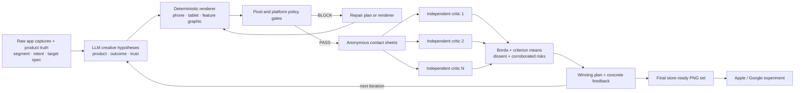
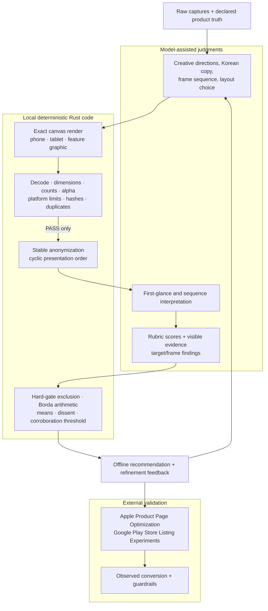
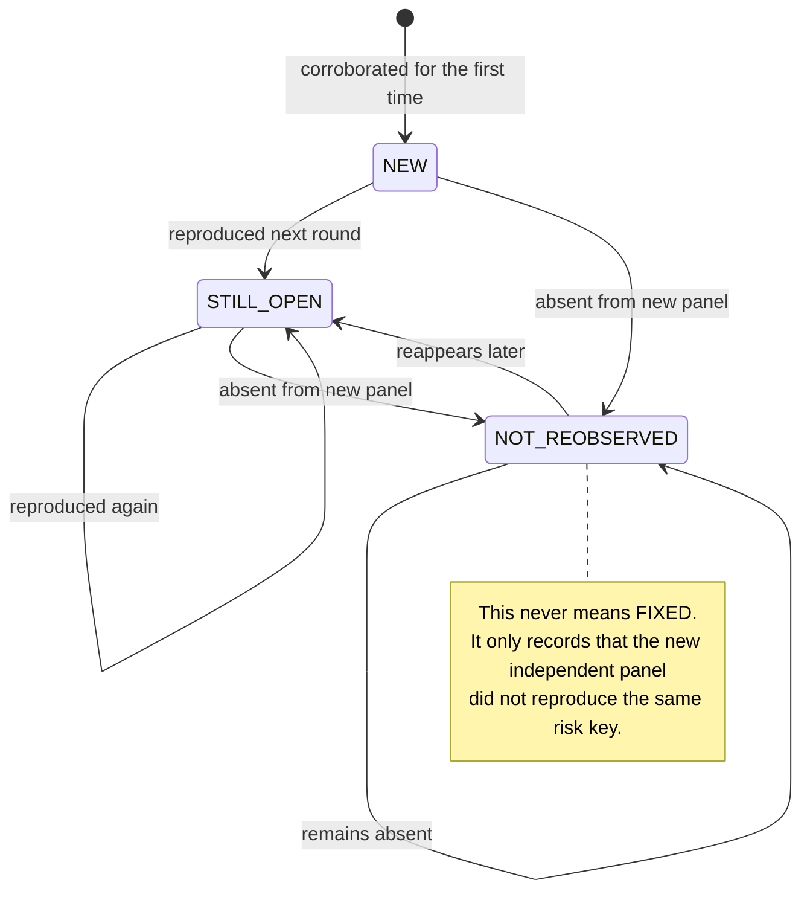

# store-creative-loop

`storeloop` turns raw app captures into real app-store PNG sets for phone, tablet, and Google Play feature graphics. It generates segment-specific `product_led`, `outcome_led`, and `trust_led` hypotheses, renders every target deterministically, rejects invalid exports or unsupported trust claims, compares the valid variants blindly, and feeds the winning plan plus observed risks into the next generation round.

Review is an internal gate in the creation loop—not the product itself, and never a substitute for a live store experiment.

## The screenshot creation loop



## Who is allowed to decide what?



## Refinement state semantics



## Why a dedicated screenshot loop?

[`aso-loop`](https://github.com/Loop-Suite/aso-loop) handles listing text and [`icon-loop`](https://github.com/Loop-Suite/icon-loop) handles icons. Store screenshots need an ordered story across device classes: marketing copy sits over real product UI, the first frames must work at thumbnail scale, tablet composition cannot be a blind phone enlargement, and every store target has exact export constraints.

The creative plan is editable JSON and the renderer is deterministic. The same plan and source captures therefore reproduce the same target files without another model call.

## Input convention

Raw captures live under the `source_target` declared in `[generation]`. Lexical filename order is the initial feature order. Add another folder named after any screenshot target to use real device-specific sources; if it is absent, the renderer safely falls back to the primary source set.

```text
raw/
  apple_iphone_69_ko/
    01.png
    02.png
    03.png
  apple_ipad_13_ko/       # optional target-specific override
    01.png
    02.png
    03.png
  google_tablet_ko/       # optional target-specific override
    01.png
    02.png
    03.png
```

Start from [`specs/example.toml`](specs/example.toml). It defines the brand, style direction, palette, allowed layouts, three creative families, audience segments, verified claim tokens, product truths, generation model, target canvas sizes, critique criteria, and experimental guardrails. Its primary Apple targets use the current 6.9-inch iPhone (`1260×2736`) and 13-inch iPad (`2064×2752`) sizes. Platform rules change, so re-check official specifications before submission.

`verified_claim_tokens` is deliberately empty by default. Rankings, awards, ratings, review/download counts, percentages, guarantees, and superlatives are rejected unless the exact supporting token is explicitly allowlisted.

## Generate screenshots

Requirements: a Rust toolchain, a Korean-capable TTF/OTF/TTC font, and either Claude CLI or `OPENROUTER_API_KEY` according to the spec.

```bash
cargo build --release

target/release/storeloop generate \
  --spec specs/example.toml \
  --raw ./raw \
  --font /path/to/KoreanFont.ttc \
  --out ./runs/store-set-01 \
  --segment new_user \
  --variants 3 \
  --iterations 2 \
  --critics 3
```

Each iteration performs segment selection → three-family hypothesis planning → render → validate → blind review → refinement feedback. The first frame uses the UI-dominant layout when available, and every plan receives a stable hypothesis id. The final winner is copied to `final/`.

To edit the generated copy, sequence, colors, or layouts manually and reproduce the PNGs without another LLM call:

```bash
target/release/storeloop render \
  --spec specs/example.toml \
  --raw ./raw \
  --font /path/to/KoreanFont.ttc \
  --manifest ./runs/store-set-01/round-01/generation.json \
  --out ./rerendered-candidates
```

Existing externally designed candidates can still enter at the validation or review stage:

```bash
target/release/storeloop validate \
  --spec specs/example.toml \
  --candidates ./candidates \
  --json ./validation.json

target/release/storeloop review \
  --spec specs/example.toml \
  --candidates ./candidates \
  --out ./runs/review-01 \
  --critics 3
```

## Outputs

- `round-NN/generation.json`: selected segment, target-specific source manifest, creative family, hypothesis id, editable plans, and generation provenance.
- `round-NN/candidates/`: rendered phone, tablet, and feature-graphic variants.
- `round-NN/review/state.json`: policy evidence, blind map, independent reviews, arithmetic, and risk state.
- `round-NN/review/report.md`: offline recommendation, dissent, provider warnings, and corroborated risks.
- `round-NN/review/experiment.md`: Apple/Google test pre-registration handoff.
- `final/`: final-round winning PNG set, ready for human submission review.
- `winner.json` and `summary.md`: selected creative plan and concise run summary.

## Safeguards and verdict boundary

- Rendering, pixel size, actual alpha, target count, hashes, anonymization, rank arithmetic, and risk thresholds are deterministic.
- Prohibited phrases and unverified rating/ranking/award/percentage/guarantee markers are blocked before rendering.
- A target-specific raw folder is used when present; primary phone sources are only a fallback, never silently preferred over real tablet captures.
- Planning, copy, visual interpretation, and rubric scores are model judgments.
- Critics do not see one another; candidate order rotates to reduce anchoring and position bias.
- A policy-blocked variant cannot win, regardless of model preference.
- A risk needs two independent critics before it becomes corroborated.
- `NOT_REOBSERVED` never silently becomes “fixed.”
- The winner is an offline model-assisted recommendation. Only a registered live experiment can support a conversion claim.

## Research basis

The architecture follows a multi-angle survey of Loop-Suite patterns, open-source store-creative generators and capture tools, visual-regression infrastructure, research on rapid visual judgment and judge bias, design-team critique practices, and controlled experimentation. See [`docs/research-and-evidence-survey-2026-08-02.md`](docs/research-and-evidence-survey-2026-08-02.md).

## License

Apache-2.0. See [`NOTICE`](NOTICE) for derived-code attribution.
